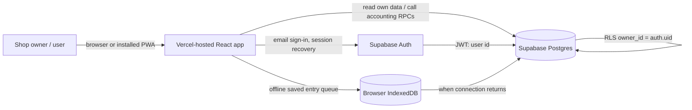
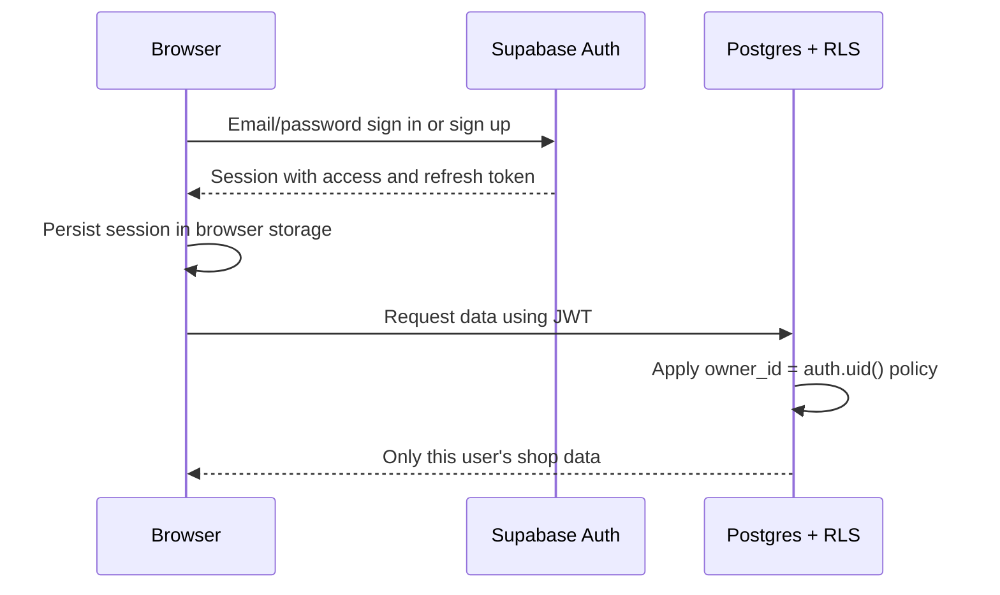
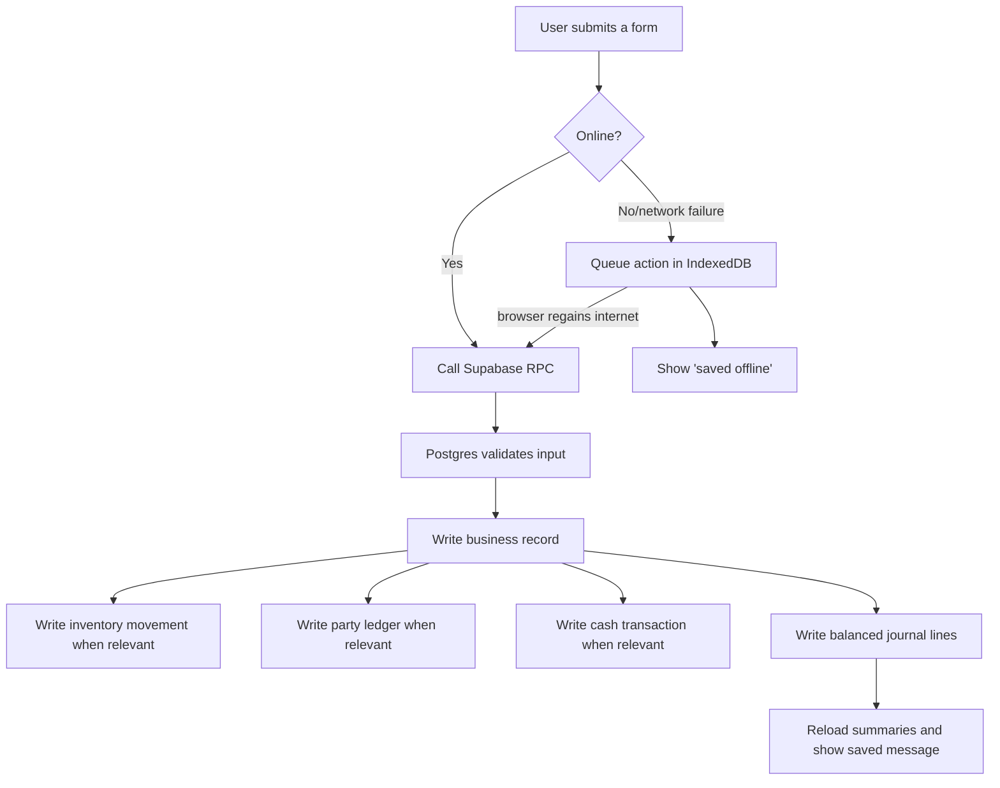

# ABCS architecture

This document describes the live architecture of **ABCS — Agriculture Business Commission Shop**. It is written for developers, testers, and the shop team.

## 1. System at a glance



### Technology choices

| Area | Technology | Responsibility |
|---|---|---|
| Web application | React 19 + Vite | One-page interface and forms |
| Styling/icons | Tailwind utilities + Lucide React | Responsive UI and icons |
| Hosting | Vercel | Builds and serves the static PWA |
| Authentication | Supabase Auth | Email/password accounts, session refresh, password reset |
| Database | Supabase Postgres | Private shop data, accounting records, business rules |
| Data access | `@supabase/supabase-js` | Browser reads and authenticated RPC calls |
| Offline queue | IndexedDB + Workbox service worker | Keeps supported saving actions until internet returns |
| PWA | `vite-plugin-pwa` | Installable app shell and offline static assets |

## 2. Runtime entry points

| File | Purpose | Status |
|---|---|---|
| `src/main.jsx` | Actual browser entry point. It renders `AgricultureApp.jsx`. | Active |
| `src/AgricultureApp.jsx` | Main interface, authentication UI, navigation, forms, dashboards, Settings, and Help. | Active |
| `src/supabaseClient.js` | Creates the Supabase browser client. Session persistence and automatic refresh are enabled. | Active |
| `src/agriOffline.js` | Routes accounting saves to Supabase RPCs; queues network failures in IndexedDB. | Active |
| `src/offlineStore.js` | IndexedDB helper used by the current offline queue. | Active |
| `vite.config.js` | Vite/PWA build configuration. | Active |
| `vercel.json` | Vercel build options and browser security headers. | Active |
| `src/App.jsx`, `src/firebase.js`, `src/offlineSync.js`, `src/ChangePassword.jsx`, `src/Login.jsx`, `src/Signup.jsx` | Old Firebase/automobile-project code retained in the repository but **not rendered by `main.jsx`**. | Legacy; do not extend for ABCS |

## 3. Frontend structure

The application is one React page with view state, rather than URL routes. The header provides Dashboard, Settings, Menu, and Logout. The horizontal navigation/menu opens these views:

1. Dashboard
2. People
3. Crops
4. Crop received
5. Sell crop
6. Expenses
7. Income
8. Reports
9. Cash
10. Settings
11. Help

### Data loading

After authentication, `AgricultureApp.jsx` loads the current user’s:

- `parties`
- `products`
- `v_cash_balances`
- `v_party_balances`
- `v_inventory_stock`
- active `cash_accounts`

The dashboard total is calculated in the browser from these returned, RLS-filtered rows. Each successful save reloads these summaries.

### UI feedback

- A green toast indicates a successful save.
- A red toast/error text indicates an error.
- Offline saves show a message that they will sync automatically.
- A 900 ms same-action cooldown prevents accidental double-click saves. This is a usability guard only; it is not a server security boundary.

## 4. Authentication and session design



`src/supabaseClient.js` explicitly enables:

- `persistSession: true` — the same browser opens directly into the account after a refresh or browser restart.
- `autoRefreshToken: true` — the client refreshes a valid session automatically.
- `detectSessionInUrl: true` — password-reset links can create a recovery session.

The app supports sign in, sign up, forgotten-password email, recovery-password screen, change email, change password, and global sign out. The Settings screen gives the signed-in user access to these actions.

**Shared device rule:** a user must press Logout after using a shared phone/computer. Session persistence is intentionally convenient on a personal device.

## 5. Multi-shop isolation

Every registered user owns one separate shop. The `supabase-individual-shops.sql` migration adds `owner_id` to each business table and creates row-level security policies equivalent to:

```sql
owner_id = auth.uid()
```

As a result, a farmer, product, crop sale, ledger entry, cash account, or report belonging to one logged-in user is invisible to every other user. Each new user is automatically given their own **Cash in Hand** account and standard chart of accounts by `bootstrap_personal_shop()`.

This is one private shop per account, not a shared-staff shop. Adding shared employees to a single shop would require a future `shops` and `shop_members` design.

## 6. Save and accounting flow

The frontend does not create multi-table accounting records itself. It calls Postgres RPC functions, which validate inputs and atomically create the linked records.



Supported RPC functions are:

- `record_cash_movement`
- `record_crop_receipt`
- `record_crop_sale`
- `record_expense`
- `record_income`

## 7. Offline behaviour

The PWA caches application files so the shell opens without internet. Accounting saves listed above are queued in browser IndexedDB when the network is unavailable or an RPC request has a network/fetch/timeout failure.

Rules:

- The queue stores the `userId`, so one browser user cannot sync another user’s queued entries.
- Entries sync in creation order when the browser returns online.
- Sync stops at the first server error to preserve order; later actions wait behind it.
- Do not clear browser/site data until pending records sync.
- People and crop master-data creation/editing are currently direct online Supabase writes, not offline-queued actions.

## 8. Deployment and configuration

### Required frontend variables

Only these values go in `.env` locally and Vercel Environment Variables:

```text
VITE_SUPABASE_URL=https://your-project.supabase.co
VITE_SUPABASE_ANON_KEY=your_publishable_or_anon_key
```

Never expose a Supabase database password, `service_role` key, SMTP password, Resend key, or any other server secret in Vite/Vercel frontend variables.

### Production components

| Component | Current responsibility |
|---|---|
| GitHub repository | Source control; Vercel deploys from `main` |
| Vercel | Runs `npm run build`, publishes `dist`, serves PWA and headers |
| Supabase Auth | User creation, sessions, email verification/password reset |
| Supabase Database | Data storage, RLS, views, and accounting RPC functions |

### Security headers configured in `vercel.json`

- `X-Content-Type-Options: nosniff`
- `X-Frame-Options: DENY`
- `Referrer-Policy: strict-origin-when-cross-origin`
- `Permissions-Policy: camera=(), microphone=(), geolocation=()`

## 9. Abuse protection boundaries

The browser application cannot reliably enforce IP rate limiting because attackers can bypass browser JavaScript and call public endpoints directly.

- **Supabase Authentication → Rate Limits** protects Auth requests, including sign in, sign up, verification, and recovery.
- **Supabase Authentication → Attack Protection** should use CAPTCHA/Cloudflare Turnstile before broad public signup.
- **Vercel Firewall/WAF** can limit requests by IP to the Vercel website.
- Direct database write traffic should move behind Supabase Edge Functions before implementing strict per-IP limits for every cash/crop/ledger action.

See `PRODUCTION_SECURITY_CHECKLIST.md` for the operational checklist.

## 10. Local development

```powershell
npm install
npm run dev
```

Open `http://localhost:5173`. For release checking:

```powershell
npm run lint
npm run build
```

## 11. Important maintenance rules

1. Do not modify accounting tables from the browser for normal transactions; extend/create an RPC instead.
2. Do not remove or weaken owner-based RLS policies.
3. Do not use the original broad authenticated-user policies from the base schema in a public installation.
4. Do not delete/recreate crop, sales, cash, or ledger records casually; accounting records should be corrected by a controlled reversal/correction workflow in a future version.
5. Keep SQL migrations in source control and run a tested migration on a copy/backup before production changes.
