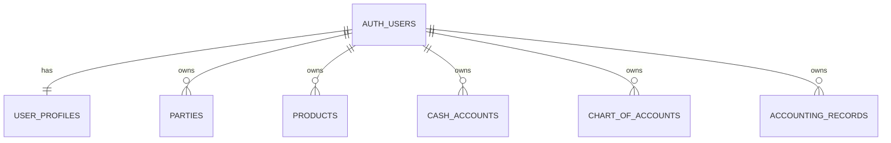
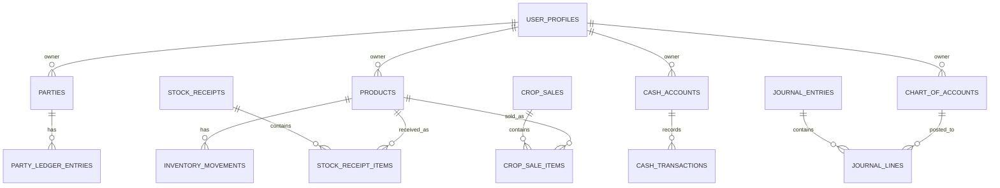

# ABCS database guide

This document is the data dictionary and database operating guide for ABCS. The database is Supabase Postgres in the `public` schema. User identity is stored by Supabase in `auth.users`.

## 1. Required migration order

For a new empty project, use this order:

1. `supabase-reset.sql` — only if an old/incorrect test schema needs to be removed.
2. `supabase-schema.sql` — base agriculture/accounting tables, constraints, initial accounts, views, and RLS enablement.
3. `supabase-finance-update.sql` — cash movement RPC.
4. `supabase-crop-update.sql` — crop receipt RPC.
5. `supabase-complete-workflows.sql` — crop sale, expense, and income RPCs.
6. `supabase-individual-shops.sql` — required for the live multi-user/private-shop version. It clears business test data, adds `owner_id`, changes unique constraints, creates owner-based RLS policies, and seeds every user’s personal shop.

> Warning: `supabase-individual-shops.sql` deliberately deletes existing **business/test data**. It does not delete Supabase Auth users. Do not rerun it on a shop containing real records.

## 2. Ownership and security model

- `user_profiles.id` is the same UUID as `auth.users.id`.
- All business tables have `owner_id` after the individual-shop migration.
- `owner_id` defaults to `auth.uid()` when the logged-in user writes a row.
- RLS allows an authenticated user to read/write only rows where `owner_id = auth.uid()`.
- `bootstrap_personal_shop(user_id)` creates standard accounts for each new/existing user.
- `create_user_profile()` is an `auth.users` trigger that creates the profile then bootstraps the shop.

### Critical note about the base schema

`supabase-schema.sql` was written for one shop and contains broad `using (true)` authenticated policies. Those policies are removed by `supabase-individual-shops.sql`. **The private multi-user migration is mandatory before sharing the app.**

## 3. Entity relationship map

## 4. Table dictionary

### Identity and master data

| Table | Purpose | Main columns |
|---|---|---|
| `user_profiles` | Profile connected one-to-one to Supabase Auth user. | `id`, `full_name`, `email`, `is_active`, timestamps |
| `parties` | Every person/business: farmer, buyer, lender, worker, etc. A party can have multiple roles. | `id`, `owner_id`, `name`, `roles[]`, `contact_person`, `phone`, `email`, `address`, `notes`, `is_active` |
| `products` | Crops/products held or traded by a shop. | `id`, `owner_id`, `name`, `category`, `default_unit`, `maund_weight_kg`, `bag_weight_kg`, `minimum_stock_kg`, `notes` |
| `markets` | Market/mandi information. The current UI does not yet expose a market form. | `id`, `owner_id`, `name`, `location`, `notes`, `is_active` |
| `cash_accounts` | Places where cash is held, such as Cash in Hand or a bank account. | `id`, `owner_id`, `name`, `account_code`, `is_cash_in_hand`, `is_active`, `notes` |
| `chart_of_accounts` | Standard accounting account list used to create balanced journals. | `id`, `owner_id`, `code`, `name`, `account_type`, `is_system`, `is_active` |

### Crop and stock records

| Table | Purpose | Main columns |
|---|---|---|
| `stock_receipts` | Header for crop coming into the shop/land stock. | `id`, `owner_id`, `receipt_number`, `receipt_date`, `source`, `party_id`, `market_id`, `total_amount`, `paid_amount`, `notes` |
| `stock_receipt_items` | Lines inside a crop receipt. Current UI saves one item per receipt. | `id`, `owner_id`, `receipt_id`, `product_id`, `quantity`, `unit`, `quantity_kg`, `rate_per_unit`, `line_total` |
| `crop_sales` | Header for crop sold to a buyer. | `id`, `owner_id`, `sale_number`, `sale_date`, `buyer_id`, `market_id`, `total_amount`, `received_amount`, `commission_amount`, `notes` |
| `crop_sale_items` | Lines inside a sale. Current UI saves one item per sale. | `id`, `owner_id`, `sale_id`, `product_id`, `quantity`, `unit`, `quantity_kg`, `rate_per_unit`, `line_total` |
| `inventory_movements` | Immutable stock in/out ledger in kilograms. This drives stock balance. | `id`, `owner_id`, `movement_date`, `product_id`, `quantity_in_kg`, `quantity_out_kg`, `unit_cost_per_kg`, `source_type`, `source_id`, `notes` |

### Cash, party ledger, and accounting records

| Table | Purpose | Main columns |
|---|---|---|
| `party_ledger_entries` | What a party owes the shop (receivable) or the shop owes a party (payable). | `id`, `owner_id`, `entry_date`, `party_id`, `balance_type`, `effect`, `amount`, `entry_type`, `source_type`, `source_id`, `notes` |
| `cash_transactions` | Cash in/cash out book for each cash account. | `id`, `owner_id`, `transaction_date`, `cash_account_id`, `direction`, `amount`, `party_id`, `transaction_type`, `source_type`, `source_id`, `journal_entry_id`, `notes` |
| `journal_entries` | Accounting entry header/narration. | `id`, `owner_id`, `entry_date`, `entry_number`, `narration`, `source_type`, `source_id`, `is_posted` |
| `journal_lines` | Debit/credit lines belonging to a journal entry. Each line permits exactly one positive side. | `id`, `owner_id`, `journal_entry_id`, `account_id`, `party_id`, `debit`, `credit`, `notes` |
| `expense_entries` | Expense register including labour, salary, market fee, transport, etc. | `id`, `owner_id`, `expense_date`, `category`, `party_id`, `market_id`, `amount`, `paid_amount`, `notes` |
| `income_entries` | Commission, service charge, and other income register. | `id`, `owner_id`, `income_date`, `category`, `party_id`, `amount`, `received_amount`, `notes` |

## 5. Data types and validation rules

### Enumerated types

| Type | Values |
|---|---|
| `quantity_unit` | `maund`, `kg`, `bag` |
| `party_role` | `farmer`, `buyer`, `supplier`, `lender`, `labourer`, `employee`, `market_committee`, `other` |
| `stock_source` | `own_harvest`, `farmer_purchase`, `consignment`, `opening_balance`, `return_in`, `adjustment_in` |
| `cash_direction` | `in`, `out` |
| `party_balance_type` | `receivable`, `payable` |
| `balance_effect` | `increase`, `decrease` |
| `account_type` | `asset`, `liability`, `equity`, `income`, `expense` |

### Key constraints

- Quantities and monetary amounts must be positive where required.
- `paid_amount`, `received_amount`, and cash payment values cannot exceed their total amount.
- An inventory movement must contain either stock in or stock out, never both.
- A journal line must contain either a debit or a credit, never both.
- Product and party names are unique **within a shop**, not globally.
- A bag needs a positive `bag_weight_kg` before the UI can calculate kilograms.
- One maund is currently treated as **40 kg** by the UI and default schema.

## 6. Standard chart of accounts

Every new personal shop receives these system accounts:

| Code | Account | Type |
|---:|---|---|
| 1000 | Cash in Hand | Asset |
| 1010 | Bank | Asset |
| 1100 | Crop Inventory | Asset |
| 1200 | Accounts Receivable | Asset |
| 1210 | Advances to Parties | Asset |
| 2000 | Accounts Payable | Liability |
| 2100 | Borrowings Payable | Liability |
| 3000 | Owner Capital | Equity |
| 4000 | Crop Sales | Income |
| 4100 | Commission Income | Income |
| 4200 | Other Income | Income |
| 5000 | Cost of Goods Sold | Expense |
| 5100 | Labour Expense | Expense |
| 5200 | Salary Expense | Expense |
| 5300 | Market Fee Expense | Expense |
| 5400 | Operating Expense | Expense |

## 7. Database views

| View | What it calculates | Used by current UI |
|---|---|---|
| `v_cash_balances` | Cash account total: cash in minus cash out. | Yes |
| `v_party_balances` | Amount to receive and amount to pay per party. | Yes |
| `v_inventory_stock` | Crop stock: total kilograms in minus kilograms out. | Yes |
| `v_trial_balance` | Debit, credit, and net balance per chart account. | Not yet shown in the UI |

The private-shop migration recreates the first three views with `security_invoker = true`, so they respect the caller’s RLS rules. Before displaying `v_trial_balance` in a multi-user report, recreate it with `security_invoker = true` and verify that it filters by owner; it is not currently used by the live UI.

## 8. Business RPC functions

| RPC function | Creates/changes | Main validation |
|---|---|---|
| `record_cash_movement` | Cash transaction, journal entry/lines, and optional party ledger entry. | Amount must be positive; cash account and counter account must exist. |
| `record_crop_receipt` | Receipt, receipt item, inventory-in movement, journal, optional cash-out/payment and payable ledger. | Quantity/rate valid; paid amount cannot exceed total. |
| `record_crop_sale` | Sale, sale item, inventory-out movement, journal, optional cash-in and receivable ledger. | Quantity must be available in stock; received cannot exceed total. |
| `record_expense` | Expense register, journal, optional cash-out and payable ledger. | Paid amount cannot exceed expense. |
| `record_income` | Income register, journal, optional cash-in and receivable ledger. | Received amount cannot exceed income. |

The frontend calls these through `postRpc()` in `src/agriOffline.js`. Keep the database function and its `grant execute ... to authenticated` permission together when adding a new workflow.

## 9. Typical write examples

### Crop bought from a farmer for credit

If 10 maund rice is bought at Rs 4,000/maund and no money is paid now:

- Receipt total is Rs 40,000.
- Stock increases by 400 kg.
- `Accounts Payable` is credited Rs 40,000.
- Party ledger records that the shop has Rs 40,000 to give the farmer.
- Cash does not move.

### Crop sale with partial cash

If rice is sold for Rs 50,000 and Rs 20,000 is received now:

- Stock decreases by the kg amount sold.
- Cash increases Rs 20,000.
- `Accounts Receivable` increases Rs 30,000.
- Party ledger records that the buyer owes Rs 30,000.
- Crop Sales income and cost of goods sold/inventory journal lines are created.

## 10. Change-management rules

1. Back up/export real data before applying a destructive or structural migration.
2. Prefer a new numbered SQL migration; do not silently edit a SQL file that has already run in production.
3. Add `owner_id`, RLS policy, and owner-aware unique constraints to every new business table.
4. Add unit/integration tests for any new accounting RPC. A journal entry must remain balanced.
5. Avoid direct manual edits to journals, ledger, cash, and inventory movement records without a controlled correction process.
